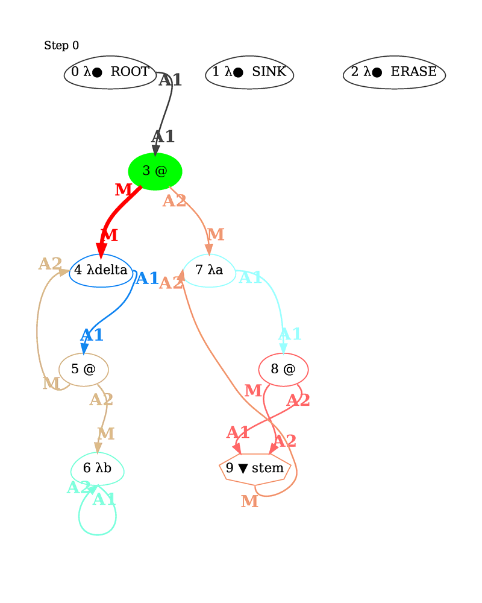

# UPDATE 23/10/2019
We have a counter example (see #1), so Éole DOES NOT work for the full untyped langage calculus!
We don't know what class of terms it can work on, but you still may find it interesting ;-)

# Éole - A Lévy-optimal lambda calculus evaluator (without oracle).

Éole is a Lévy-optimal lambda calculus evaluator, and can in some scenario be *asymptotically* faster than conventional evaluators.
It can compute "quickly enough" things that non-Lévy-optimal evaluators can't. For example, it can compute [200^200%31](tests/benchmarks/power_mod.eole) wih Church's numeral without doing anything special (i.e. without using mathematical properties).

Éole...
  * **handles the full untyped lambda calculus**
    * **WARNING:** this is not proven yet!
      And if Éole can handles at least a fragment  of the lambda calculus, the full untyped lambda calculus is questionable.
      (making this warning clearer, see [below for the original warning](#warning)).
    * based on an interaction network (a graph rewriting system).
    * Lévy-optimally (avoids duplication of redexes by sharing).
  * **comes with 2 reduction strategies**
    * reduce to normal form (default)
    * reduce to weak head normal form
  * **has an optional garbage collector** (on by default)
    * it is also modular: you can create your own!
    * specialized at compile time
  * **has an optional memory compactor** (off by default)
  * **accepts some limits**
    * reduction steps
    * readback depth (while converting the internal graph back to a lambda expression)
  * **can show you some statistics**
  * **can create a representation of the internal structure with graphviz:**
  


The gif above shows a reduction of
```
delta = a->a a.

delta (b->b).
```

In the above graph, nodes have the following format: `UID <kind>` with `<kind>`:
  * `λ x`: lambda abstraction, declaring the variable `x`
  * `λ● x`: lambda abstraction, declaring the **unused** variable `x`
    * We have the 3 special nodes Root, Sink and Erase which are *meta nodes*
  * `@`: Application node
  * `▼ stem` : "Sharer" node
  * `▼ ID` : "Share boundary" node called `fan in`
  * `▲ ID` : "Share boundary" node called `fan out`
  
The flashy red arrows show the possible interactions (several possible),
while the flashy green node indicates the next interaction (only one).
The other filled nodes between the root and the green show the stack currently stacked and that will eventually be considered for reduction.

To follow the description of the steps, get the [static pdf](doc/readme/delta_id.pdf):

0. Initial graph:
    * See how `delta = a->a a.` is translated into a function call `(λdelta->...)(λa->a a)`,
    * See how the reference to `a` is shared through a special "stem fan" node.
    * See how the identity `(λb -> b)` only involves the abstraction node:
      the variable is represented by targeting the asbtraction node itself.
1. After reduction of `(λdelta->...)(λa->a a)`.
    * Ready to reduce `(λa-> a a)(λb -> b)`.
2. After reduction of `(λa-> a a)(λb -> b)`.
    * We have `(λb -> b)(λb -> b)`, but see how `(λb -> b)` appears only once in the graph.
    * The application node `8` is stacked.
3. We start the actual duplication of `(λb -> b)`.
    * The `stem` fan "differentiates" itself into labeled fans.
    * See how the "body" (empty here) is still shared (between the fans).
    * Because the application was stacked, it is the next interacting node.
4. After the reduction of `(λb -> b)(λb -> b)` (application node 8).
    * The application is reduced even if the body of the function is still being shared
5. After the "resolution" of the share, we reach the final state `(λb -> b)`.

---

## Context

### Warning
* **Éole is experimental and not proven (WIP)**
  * Only use for research and curiosity purpose!
* **"Lévy-optimal" does not means "efficient"**
  * Even if it is asymptotically faster, it is not really efficient in common scenario.
    See [this recent summary by Asperti (2017)](https://arxiv.org/abs/1701.04240) for a quick overview also covering this point.

Éole is implemented following ideas from Levy, Lamping, Asperti, Lafont and many others.
Lambda expressions are converted into an interaction net (a computational model) which is then reduced.
A good introduction can be found in the book:
> Asperti, Andrea and Guerrini, Stefano. The optimal implementation of functional programming languages.
> Cambridge University Press, 1998.

### Summary
Interaction nets contain nodes that can interact (e.g. an application node can interact
with a lambda abstraction node). They work by applying local rewriting rules to *interacting* pairs of nodes.
They are a model of computation and can be use to implement a lambda calculus interpreter.
A lambda calculus interpreter is "Lévy-optimal" if it avoids duplicating work,
i.e. redexes, but also "virtual redexes" (things that might create redexes down the road).
This is done through "sharing" and "unsharing" which are represented respectively by "fan in" and "fan out" nodes.

When something is shared, a fan in and fan out delimiting the new share are created.
The tricky part is that several distinct shares may overlap.
When a fan in meets a fan out, is it the end of share (a "sharing" node meeting its "unsharing" counterpart),
or not (the nodes represent different shares)?
Answering that question is the main problem that Lamping was the first to solve with his algorithm.
> Lamping, John. An algorithm for optimal lambda calculus reduction.
> Proceeding POPL 1990, Pages 16-30.

The only problem is that the algorithm has a non negligible amount of overhead due to
a lot of bookkeeping operations. In some extreme cases, the bookkeeping is in O(2^n)
when the number of beta reductions is O(n).
> Julia Lawall and Harry G. Mairson. Optimality and Inefficiency : What Isn't a Cost Model of the Lambda Calculus? (1996)
> Proceedings ACM SIGPLAN 1996, Pages 92-101.

Beyond that, performing interactions in the nets amount to a pretty straightforward graph rewriting system
(special note: the garbage collection can also be challenging).
Hence, the "fans pairing" algorithm was given a special name: **the Oracle**.
In other words: do your interactions, and when two fans meet, ask the oracle what to do.
I like to think (probably inaccurately) about optimal reductions as:
> Optimal reduction = interaction net + oracle

### The Éole approach
Éole's changes are:

1. Its interaction nets are directed
1. It has two kinds of fans in:
    * Stem fans, which are "sharer" and do not have a fan out counterpart
    * Differentiated fans in, which with their fans out counterpart create "share boundaries"
1. A lazy labelling of differentiated fans in.

Stem fans differentiated themselves when crossing a lambda abstraction node.
A new unique label is created and assigned to the now differentiated fan in (going down the body of the abstraction)
and its matching fan out (following the binder).
In the current implementation, the lazy labelling is done through a global 64 bits counter.
This break the spirit of the *local rewriting rules*, but isn't a problem at all implementation wise.

More details, are to come in a paper (hopefully with a proof of Éole),
along with a discussion on the garbage collector and reduction strategies (the current implementation offers 2 of them, see below).


## Using the system (Linux instructions, probably works on mac too)

### Building
You need an up-to-date installation of Rust (but not a nightly release).
Just go in the main folder and:
```
cargo build --release
```
This will create an executable in the `target/release` folder.

Éole can generate `dot files` that can then be passed to [graphviz](https://graphviz.org/) to draw the several reduction steps.
Install `graphviz` if you want to visualize what is going on!
The `./dotgraph.sh` script creates the graphs and then assemble them using `pdfunite`
On Archlinux, pdfunite is provided by poppler.
Check your distribution for things around `poppler` (like `poppler-utils`) if you want it.


### First test
Launching
```
./target/release/eole
```
Should print the help and exit. Have a quick read!

The `tests` folder contains a several files you can try or use as example.
Let's start with something simple (linux style):
```
./target/release/eole tests/00_def.eole
```
which defines the identity function and the evaluates it (without an argument) should print:
```
(i5->i5)
```
In lambda calculus, we would write `λi5.i5`.
The `i` comes from the source and the `5` is an internal identifier.

### Generating graph
If you have `graphviz` installed, you can try
```
./launch.sh -G tests/04_delta.eole
```
Éole will create a `generated` folder and put a `dot files` per reduction step in it (plus the initial state of the network).

Note: The `launch.sh` script purpose is to clean any previous `generated` folder before calling `eole`,
forwarding all the arguments.
Then, it calls the `./dotgraph.sh` script, which generate the graphs.

The `-G` flag ask a graph per reduction step.
The `-g` flags only generate the initial and final graph.

*Never put anything in generated!* `./launch.sh` does a brutal cleaning...

* Black nodes are special nodes:
  * The root is used internally to anchor the graph.
  * Other black node are used by the garbage collector.
  * If it is a node "inside the graph", it is a temporary root for the reduction.
* The flashy green node represents the next interacting destructor.
* The flashy violet nodes represent the stack of nodes from the root to the next interacting node.
* Possible interaction are highlighted in red.

### Limiting the number of interaction
Some term can diverge, e.g. the term `(λi.i i)(λi.i i)` forever reduced into itself.
In that case, we can limit the number of interactions with the `-r` flag.
```
./launch.sh tests/05_delta_delta.eole -r 50
```
**Note:** this is a limit on the number of interactions, not β-reductions!

### Show me some stats
Add the `-v` flags:
```
./launch.sh tests/05_delta_delta.eole -r 50 -v
```
will indeed shows you that 50 is a limit on interaction: only 10 β-reductions were performed.

### Reduction strategies
By default, Éole uses a `full`strategy: it will reduce everything, i.e. if a term has a normal form, it will reach it.
For example, the following computes `3!` with Church numbers.
```
./launch.sh tests/benchmarks/fact03_noid.eole
```
This should print `(x38->(y52->(x38 (x38 (x38 (x38 (x38 (x38 y52))))))))`, i.e. 6 in Church number.
Note that the `full` strategy does not do useless work, i.e. it is *not* a "strict" or "call by value" strategy!

We can also use a lazy strategy with the '-s' flags:
```
/launch.sh tests/benchmarks/fact03_noid.eole -s lazy
```
And this will print something "bigger" because the lazy strategy stops at the weak head normal form.

### Limiting the read back
Some "small" graphs can represent quite "large" syntactic lambda terms.
The read back can be limited (in "depth" when travelling the graph) by the `-l` flag.
Try this:
```
./launch.sh tests/benchmarks/fact07_noid.eole -l 0 -v -g
```
Have a look at the graph, and then try this:
```
./launch.sh tests/benchmarks/fact07_noid.eole -v
```

### Memory options
The garbage collector can be deactivated with the `-m` flag.
Try this command and take a look at the memory used by the nodes:
```
./launch.sh tests/benchmarks/fact80.eole -v
```
Then compare with:
```
./launch.sh tests/benchmarks/fact80.eole -v -m none
```

By default, Éole never releases the memory.
This is can be seen by the `End allocation` stats,
showing the amount of memory used by the nodes just before terminating.
The compaction can be activated with the `-M` flags
```
./launch.sh tests/benchmarks/fact80.eole -v -M 1
```

## Syntax of Éole's file
A lambda abstraction is written with an arrow, e.g. `a->a` is `λa.a`
and application is done by juxtaposition.
A file can contains several definitions, terminated by a dot: `symbol = term.`
Finally, a file can contain one term to evaluate, also dot-terminated.

See the examples in the `tests` folder.
